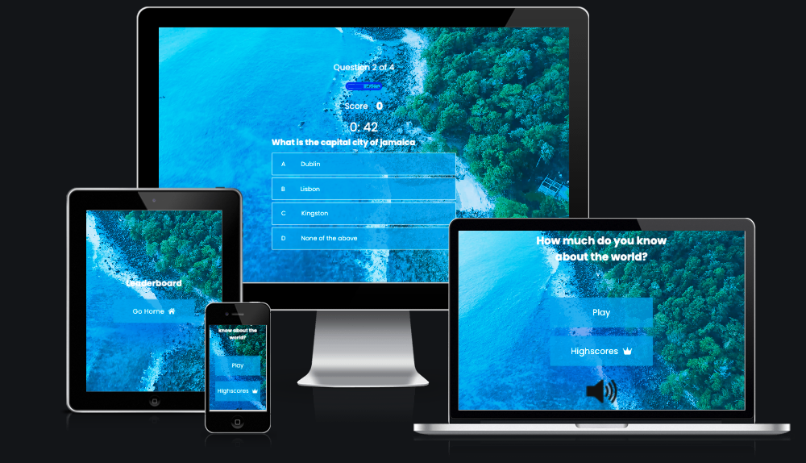

# Fitness Culture

Do you want to improve your knowledge about the world you live on? If so then this is the place. Through a variety of different questions, you will be learn an abundance of information about the world through a fun interative quiz. Rather than read textbooks, I encourage user's to make their learining as fun as possbile. This motivated me to create this quiz.

Click this link to see deployed site - https://ewicks.github.io/Geography-quiz-project-2/

## Features 

It's important that all pages are responsive on small, medium and large devices. Also that all pages are  
intuitively designed to make it easy for the user to navigate.

### Home Page Features

- __Home Page__

  - I have used a video for the background to give the user a more enjoyable and unique expearience, while playing the game there is a beautiful beach video in the background. 

  - The background has a black gradient ontop of the image to create a larger contrast in color between the white colored headings and the background video. 

- __Game Page__

  - This page provides the the question, score, progress bar and four different choices to answer from. 

  - Most of the elements on the page are centered on the page, so it's easy for the user to read.

  - Your score will be updated every updated on every question

  - The user has 1 minute to click an answer, if no answer is clicked, it will automatically go to the next question.

- __End Page__

  This section displays all 3 types of memberships that are offered. The prices vary a lot in order for everone viewing are able to buy one even if they have low incomes.

  - When the user hovers over a membership card, the card will display a shadow behind it, highlighting to the user which membership they are about to click.

- __Highscores Page__

- This page displays the users scores which will motivate them to do better the next time they play. This will keep our users keep coming back to the game giving it a sense of competitiveness. 

## UX

### fonts

### color scheme 

## Wireframes

### Features Left to Implement

- To create another quiz with an option on the homepage to choose from a logo quiz and a written question quiz to add more creativity and fun for the user.

## Testing 

The link to the full testing page, which includes validator testing, brower compatibility and responive check [click here](TESTING.md). 

## Deployment

I used GitHub pages to deploy this website. The steps are found below. 

  - First, once your logged into your GitHub account, go to your repository tab.
  - Click on the repository you are working in.
  - Press the setting tab, then click pages tab on the left hand section.
  - On the source section dropdown, select Master branch or Main branch. 
  - Then click save.
  - The page will automatically refresh when your site is successfully deployed.

The live link can be found here - https://ewicks.github.io/Geography-quiz-project-2/

### Local Deployment

## How to clone a project

In order to make a local copy of this project, you can clone it. In your IDE Terminal, type the following command to clone my repository:

- `git clone https://github.com/Ewicks/Geography-quiz-project-2.git`

Alternatively, if using Gitpod, you can click below to create your own workspace using this repository.

## How to fork a project

- Click on the repository you want to fork
- Press the button which say's fork in the top right of the screen

# Credits 

### Content and Media

- I got the background video from a website called [Pexels](https://www.pexels.com/videos/)

- I used a youtube tutorial to guide me through creating this quiz, here is the [link](https://www.youtube.com/watch?v=f4fB9Xg2JEY)

- The icons in the quiz are from [Font awesome](https://fontawesome.com/)

- Some of the questions in the quiz were taken from this [website](https://www.triviaquestionquiz.com/geography-trivia-questions/)
