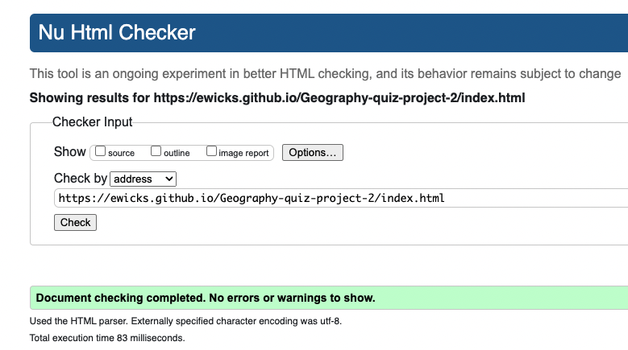
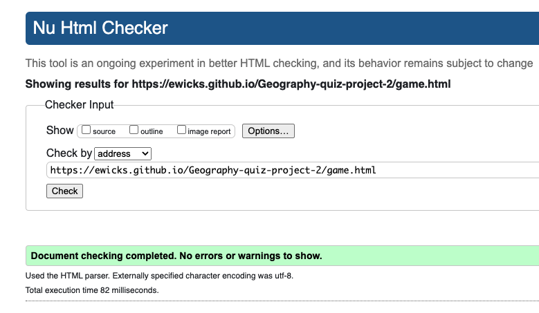
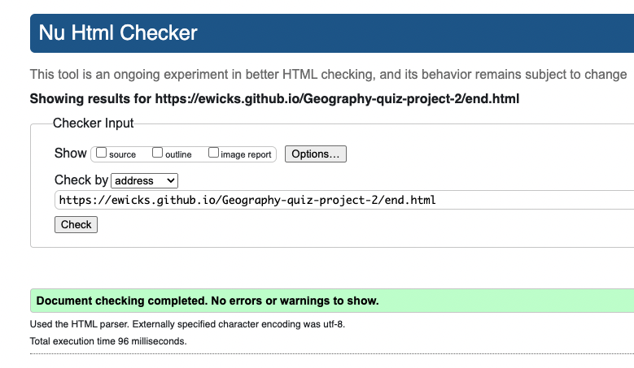
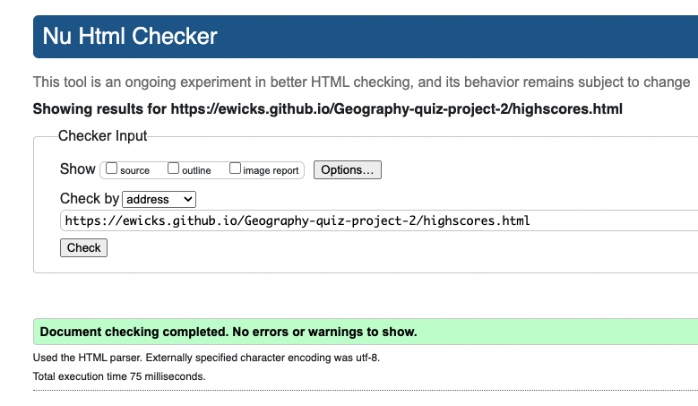
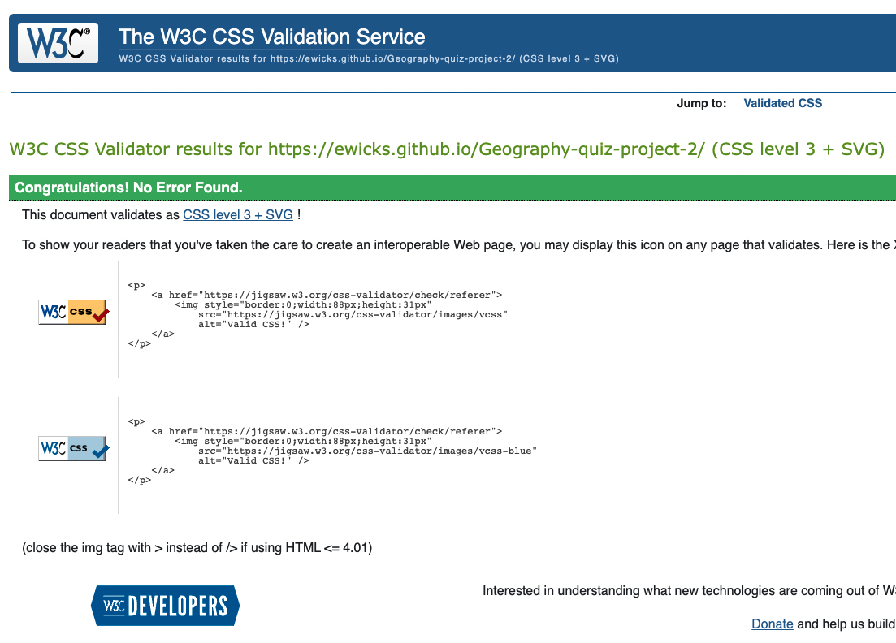
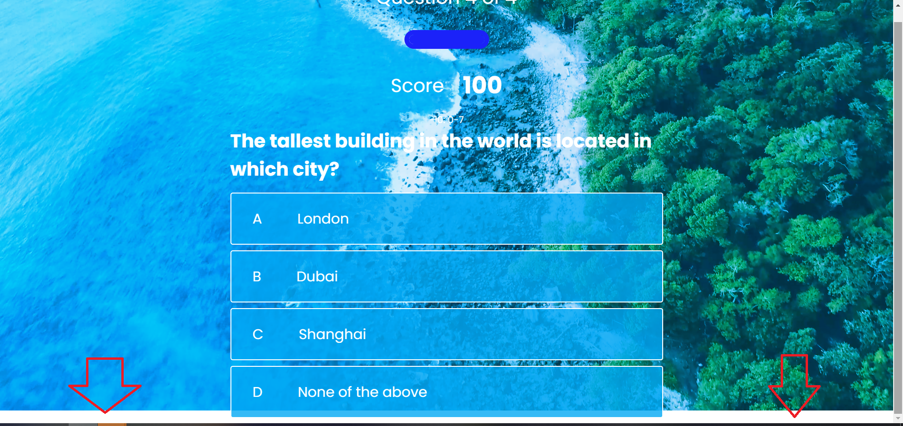
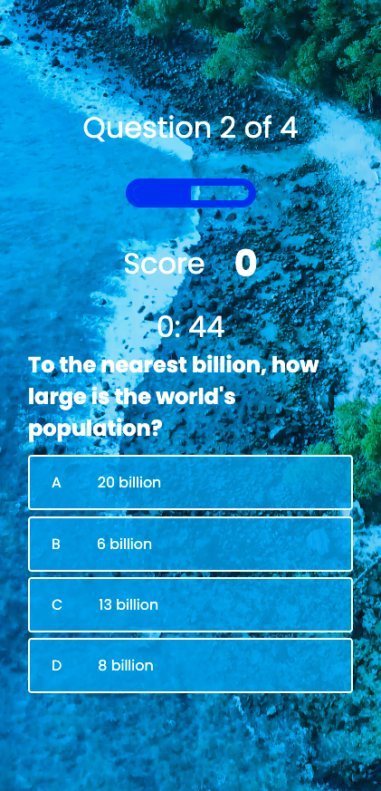
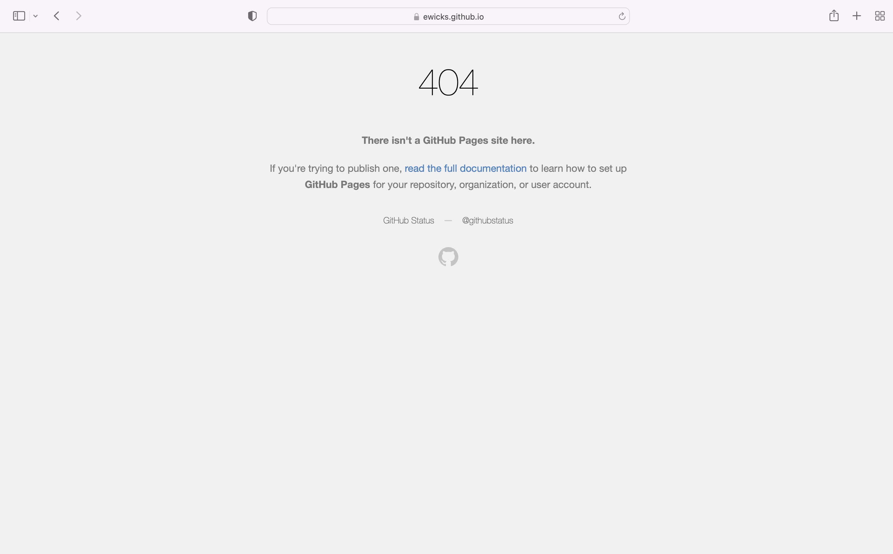

### W3C HTML Validator

## Home Page

## Game Page

## End Game Page

## Highscore Page

## CSS Pages

## Bugs

- When a user opened up the quiz with a device with a shorter height, this gap would appear moving the some elements out of frame and creating a gap below the page.
To fix this I changed the overlay and video elements position's from absolute to fixed.

- When the timer gets to zero its continues into the minus numbers. To fix this...

### Browser Compatibility

## Chrome

I have found no compatibility issues using the chrome browser.

- This is the home page in tablet mode

- This the game page in mobile mode

## Safari

- When the user presses on the save button, the user is then directed to an error page.

### Responsiveness

## Desktop

## Tablet

## Mobile

