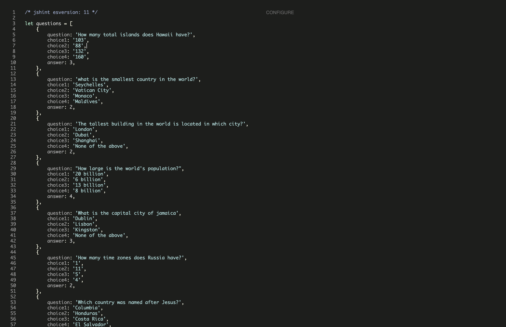
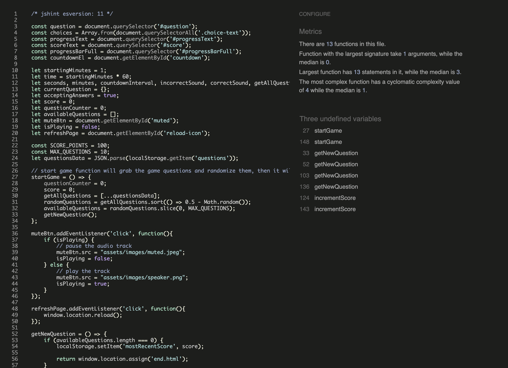
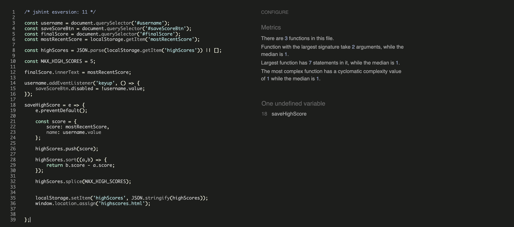
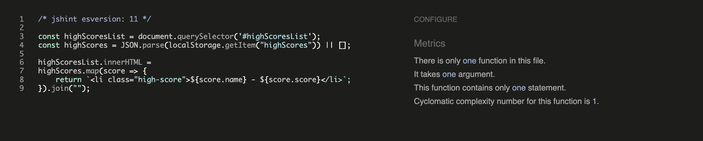
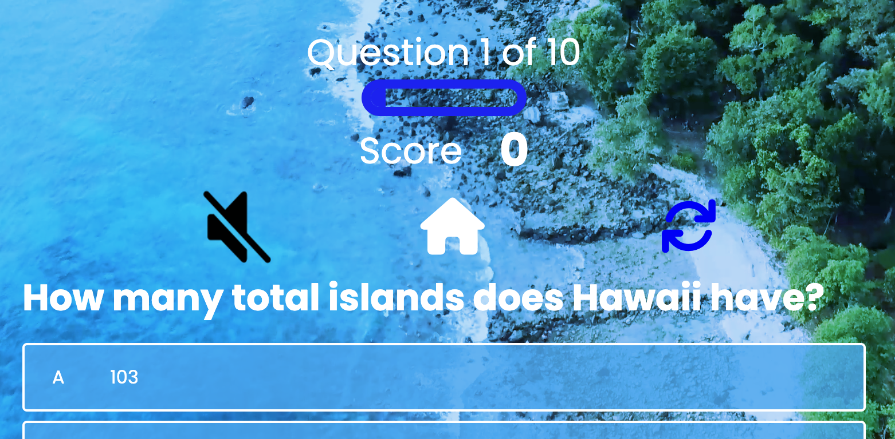
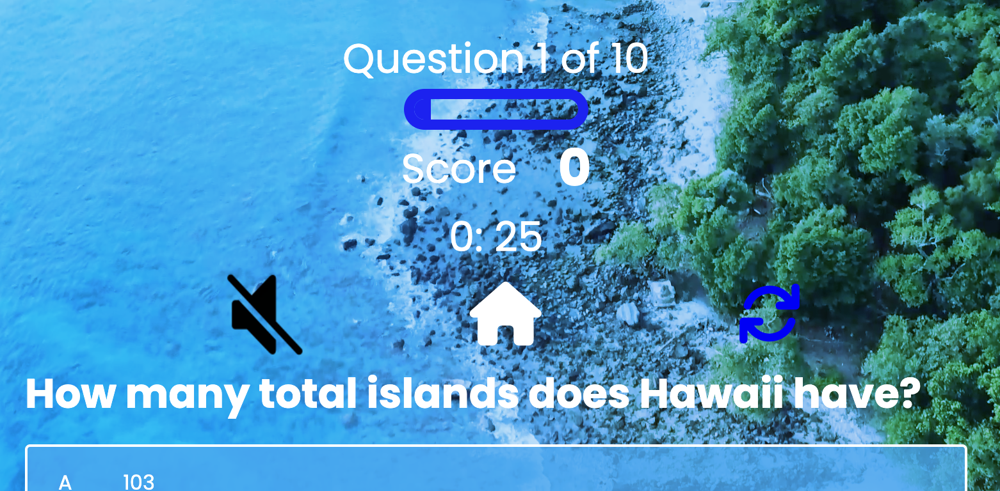
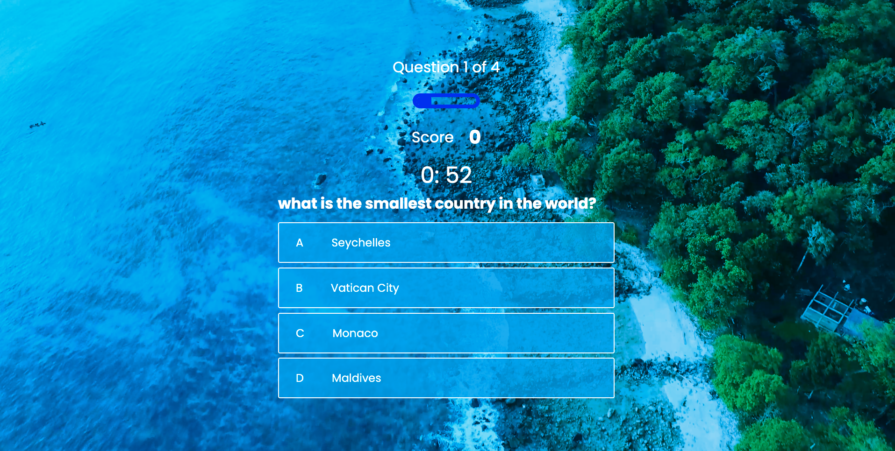

# Testing

Click here to return back to the [README.md](README.md)

## Validator Testing

- HTML
  - No errors were returned when passing through the official [W3C validator](https://ewicks.github.io/Geography-quiz-project-2)
- CSS
  - No errors were found when passing through the official [(Jigsaw) validator](https://jigsaw.w3.org/css-validator/validator?uri=https%3A%2F%2Fewicks.github.io%2FGeography-quiz-project-2)
- JS
    - No errors were returned when passing through the official [JS hint validator](https://www.jshint.com), but there are some known warnings that do not break the game.
  
## W3C HTML Validator

### Home Page

### Game Page

### End Game Page

### Highscore Page

### CSS Pages

### JS

### Preloader

### Questions js file

### Game Page

### End Game Page

### Highscore Page

## Bugs

- When a user opened up the quiz with a device with a shorter height, this gap would appear moving the some elements out of frame and creating a gap below the page.
- To fix this I changed the overlay and video elements position's from absolute to fixed.

- When the timer gets to zero its continues into the minus numbers. To fix this I reset the timer using the clear function is javascript.

- When the game page loads, there is currently no timer there. A second later the timer spawns in via the javascript. This then would shift all the elements down a bit during the gameplay. This disrupts the smoothness of the game. 

- To fix this I wrote 0: 30 in the timer div as a place holder, so it has some text there when it loads which prevents the downwards shift.

## Unfixed Bugs

- There is no unfixed bugs I am aware of.

## Browser Compatibility

### Chrome

I have found no compatibility issues using the chrome browser.

- This is the home page in tablet mode

- This the game page in mobile mode

### Safari

- This the highscores page in tablet mode

## Responsiveness

### Desktop

Here are two screenshots of the game page and end page in desktop mode.

### Tablet

Here are two screenshots of the game page and end page in tablet mode.

### Mobile

Here are two screenshots of the game page and end page in mobile mode.

