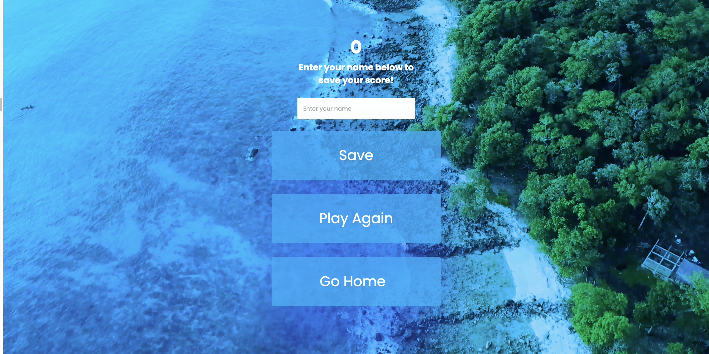
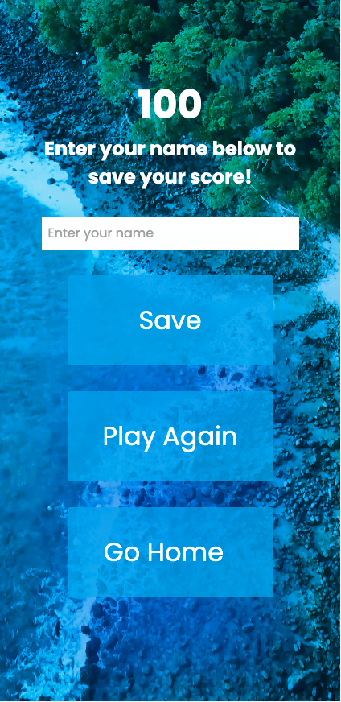

### W3C HTML Validator

## Home Page

## Game Page

## End Game Page

## Highscore Page

## CSS Pages

## Bugs

- When a user opened up the quiz with a device with a shorter height, this gap would appear moving the some elements out of frame and creating a gap below the page.
To fix this I changed the overlay and video elements position's from absolute to fixed.

- When the timer gets to zero its continues into the minus numbers. To fix this...

- When the game page loads, there is currently no timer there. A second later the timer spawns in via the javascript. This then would shift all the elements down a bit during the gameplay. This disrupts the smoothness of the game. 

- To fix this I wrote 0: 30 in the timer div as a place holder, so it has some text there when it loads which prevents the downwards shift.

### Browser Compatibility

## Chrome

I have found no compatibility issues using the chrome browser.

- This is the home page in tablet mode

- This the game page in mobile mode

## Safari

- When the user presses on the save button, the user is then directed to an error page.

- This the highscores page in tablet mode

### Responsiveness

## Desktop

Here are two screenshots of the game page and end page in desktop mode.

## Tablet

Here are two screenshots of the game page and end page in tablet mode.

## Mobile

Here are two screenshots of the game page and end page in mobile mode.

